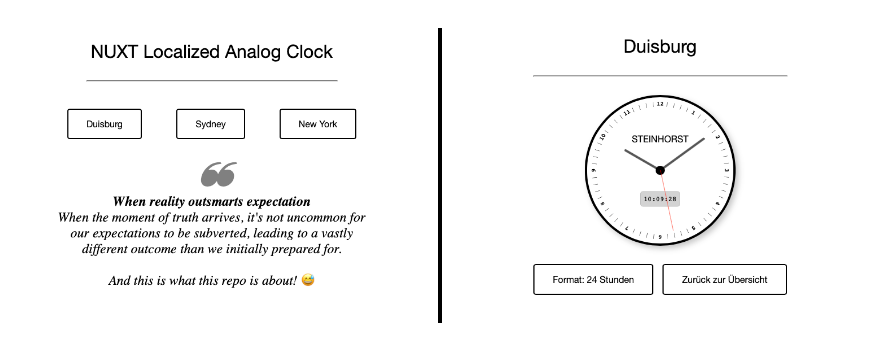

# nuxt localized analog clock

## Description
The Topic of this repo is: "When reality outsmarts expectation".

When the moment of truth arrives, it's not uncommon for our expectations to be subverted, leading to a vastly different outcome than we initially prepared for.
And this is what this repo is about! 😅

## Features
- Analog Clock
- Localized Time (Duisburg, Sydney, New York)
- 12h and 24h format (switchable)

## Technologies
- Nuxt.js
- Vue.js
- SCSS (BEM)

## Installation
1. Clone the repo
2. Run `pnpm i`
3. Run `pnpm dev`
4. Open `http://localhost:3000` in your browser
5. Enjoy! 🎉
